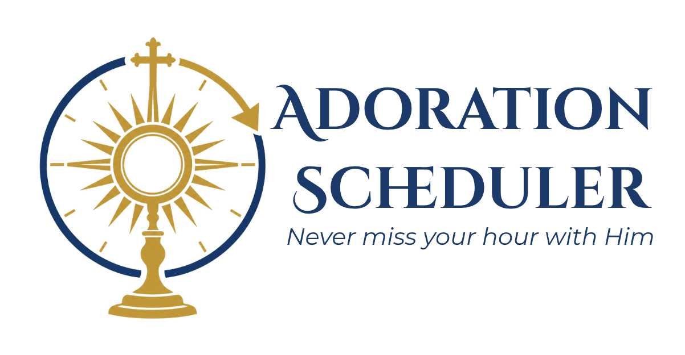

  

Adoration Scheduler turns WordPress into a complete Eucharistic Adoration scheduling system for parishes. It brings scheduling, signups, substitute coordination, communications, and access control together in one WordPress admin experience — with a secure public portal adorers can use without ever creating a WordPress account.

## Highlights

### Scheduling and slots
- Run one-time or multi-day events, weekly perpetual (round-the-clock) adoration, and monthly nth-weekday devotions (e.g. First Friday, Last Sunday) — all from one plugin.
- Support multiple chapels or locations, including overnight hours that roll past midnight.
- Generate adoration time slots automatically, with a daily background job keeping perpetual and monthly schedules filled out on a rolling window.
- Set minimum and maximum adorers per hour, and schedule closures (holidays, cancellations) that are respected automatically going forward.

### Signups and substitutes
- Public signup form — no WordPress account required.
- Standing weekly commitments for perpetual schedules, with per-date skip/cancel.
- Replacement requests let an adorer flag an hour as needing coverage without cancelling outright.
- Direct-to-person swap requests let an adorer ask one specific person to cover an hour privately, or open the request to the whole community of opted-in substitutes.
- A "Coverage Needed" board and an "Asked of You" view keep everyone aware of open requests.
- Waitlists: signing up for a full hour offers a spot in line instead of a dead end, and whoever's been waiting longest is automatically confirmed the moment someone cancels — no admin action needed.

### Accounts and access
- Secure "magic link" email sign-in, with an optional password as a second sign-in method.
- Optional approval-gated access, so a parish can require a short request before adorers can use the portal.
- A modular "My Adoration" portal built from composable shortcodes — standing hours, upcoming signups, profile card, replacement requests, announcements — so a parish can lay out its own page.
- Self-service profile editing, including clergy titles and parish affiliation.
- Self-service "Download My Data" export and "Delete My Account" — an adorer can download a copy of their profile, standing hours, and signup history, or anonymize their own account, cancelling future hours and revoking sign-in access without disturbing past coverage history.

### Communications
- Automatic email confirmations, reminders, and cancellations — every outgoing email is editable from Email Templates, with merge tags and a send-test tool.
- Daily coverage-gap alert emails warning staff about unfilled hours coming up soon, with a configurable time window and recipient address.
- Parish announcements shortcode for the portal.
- Admin email log with resend tools.
- Personal iCal subscribe feed so an adorer's own confirmed hours stay synced to their phone or computer calendar automatically.
- Public "open hours" board and calendar feed per schedule, showing fill status with no adorer names — safe to advertise on a public page.

### Administration
- Consolidated, simplified admin menu.
- Signup audit trail for accountability.
- Built-in Pages & Shortcodes diagnostic tool to confirm the portal is wired up correctly.
- Privacy controls for what's shown on public listings.
- Bulk roster import and export in CSV or XLSX (Excel) format, with a review-before-you-commit preview that flags new people, updates, and email conflicts.
- Schedules list export in CSV or XLSX.
- Printable rosters — a clean, chapel-binder-friendly page per schedule and date range, grouped by date/time with names and phone numbers, ready to print or save as a PDF from the browser.

## Requirements

- WordPress 6.2 or newer
- PHP 8.0 or newer
- MySQL or MariaDB
- No external services required

## Installation

1. Place the plugin in `wp-content/plugins/adoration-scheduler`.
2. Activate **Adoration Scheduler** from the WordPress Plugins screen.
3. On activation, the plugin automatically creates its database tables, a default chapel, a "My Adoration" page, and schedules its daily background jobs.
4. Open **Adoration Scheduler** in the WordPress admin menu to create a chapel and your first schedule.

## Project information

- Designed and developed by Fr. Andrew M. Boyd
- Plugin website: [fatherboyd.com/adoration-scheduler](https://fatherboyd.com/adoration-scheduler)
- Repository: [github.com/boydspace/adoration-scheduler](https://github.com/boydspace/adoration-scheduler)
- Translation domain: `adoration-scheduler`
- Public PHP constants and classes: `ADORATION_SCHEDULER_*` and `AdorationScheduler\*`

## Roadmap

- SMS reminders (pending a provider decision)
- Expanded accessibility and mobile usability review

## Development status

Adoration Scheduler is under active development. Test upgrades carefully before using a development build with irreplaceable parish scheduling data.

## License

License information will be added before the first public release.
